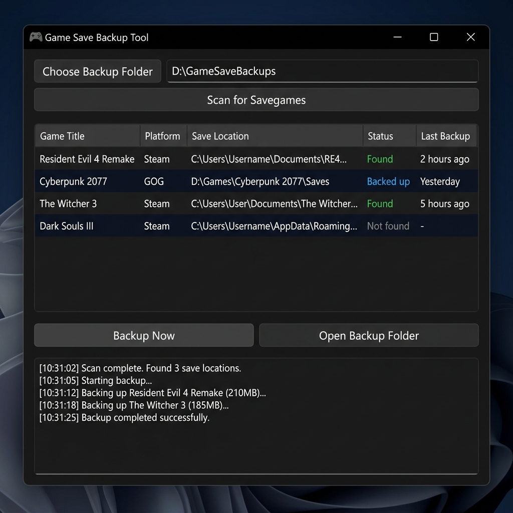
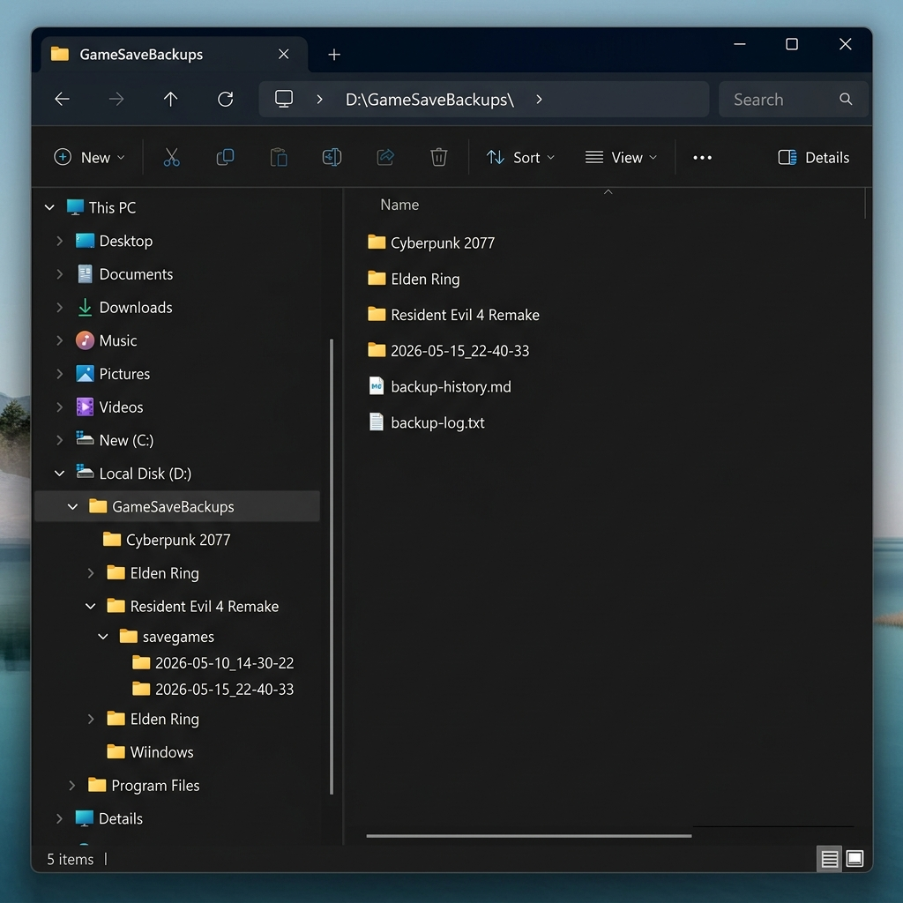
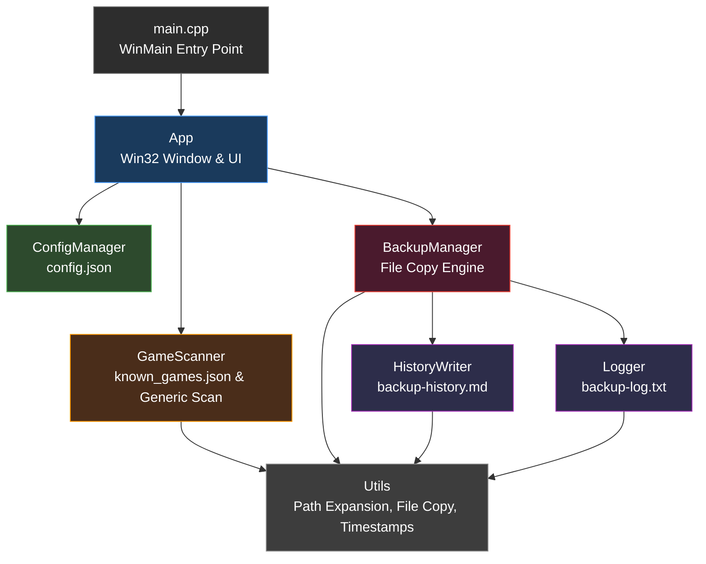

# 🎮 Game Save Backup Tool

A lightweight Windows desktop application that automatically locates game savegames on your PC and backs them up to a folder of your choice. Never lose your progress again — protect your saves before formatting, swapping SSDs, or reinstalling Windows.

---

## ✨ Features

- **Automatic save detection** — Scans common Windows locations for game saves
- **94+ known games** — Ships with a built-in database of popular AAA game save paths (easily expandable via JSON)
- **Smart Steam detection** — Automatically finds Steam installations on any drive via Windows Registry
- **Repack support** — Detects CODEX, RUNE, TENOKE, PLAZA, and Goldberg emulator save locations
- **Generic scan** — Also searches for save-related folders by keyword (`save`, `savedata`, `profile`, etc.)
- **Timestamped backups** — Each backup creates a new timestamped folder, never overwriting previous backups
- **Markdown history** — Automatically generates and updates a `backup-history.md` with a detailed log of every backup session
- **Persistent configuration** — Remembers your last backup folder between sessions
- **Safe by design** — Never deletes, moves, or modifies your original save files
- **Dark theme UI** — Clean, modern native Windows interface
- **Single `.exe`** — No installer needed, just run it

---

## 📸 Screenshots

### Main Application Window



### Backup Folder Structure



Each backup creates an organized folder structure:

```
D:\GameSaveBackups\
├── Resident Evil 4 Remake\
│   └── savegames\
│       ├── 2026-05-10_14-30-22\
│       │   └── [original save files]
│       └── 2026-05-15_22-40-33\
│           └── [original save files]
├── Cyberpunk 2077\
│   └── savegames\
│       └── 2026-05-15_22-40-33\
│           └── [original save files]
├── backup-history.md
└── backup-log.txt
```

---

## 🚀 Getting Started

### Prerequisites

- **Windows 10 or 11**
- **Visual Studio 2019+** with C++ desktop development workload (or standalone MSVC compiler)
- **CMake 3.15+**

### Building from Source

```powershell
# Clone the repository
git clone https://github.com/YOUR_USERNAME/game-save-backup-tool.git
cd game-save-backup-tool

# Create build directory
mkdir build
cd build

# Configure and build
cmake ..
cmake --build . --config Release
```

The compiled executable will be at:

```
build\Release\GameSaveBackupTool.exe
```

### Running

1. Copy `GameSaveBackupTool.exe` and `known_games.json` to the same folder.
2. Double-click `GameSaveBackupTool.exe`.
3. Click **"Choose Backup Folder"** to select where backups will be stored.
4. Click **"Scan for Savegames"** to detect installed games.
5. Click **"Backup Now"** to create a backup.
6. Done! Your saves are safe. 🎉

---

## 📂 Project Structure

```
GameSaveBackupTool/
├── CMakeLists.txt          # Build configuration
├── known_games.json        # Editable game database
├── INSTRUCTIONS.md         # Original project specification
├── README.md               # This file
├── .gitignore
├── docs/
│   ├── screenshot_main.png
│   └── screenshot_folder_structure.png
├── vendor/
│   └── json.hpp            # nlohmann/json (header-only, MIT)
└── src/
    ├── main.cpp            # Entry point (WinMain)
    ├── App.h / App.cpp     # Main window and UI
    ├── BackupManager.h/cpp # File copy and backup logic
    ├── GameScanner.h/cpp   # Save path detection
    ├── ConfigManager.h/cpp # Persistent settings (config.json)
    ├── HistoryWriter.h/cpp # Markdown history generation
    ├── Logger.h/cpp        # Technical log file
    ├── Utils.h/cpp         # Path utilities, env vars, wildcards
    └── resource.h          # Control IDs and constants
```

---

## 🏗️ Architecture

The application follows a modular architecture with clear separation of concerns:



| Component | Responsibility |
|-----------|---------------|
| **App** | Win32 window, UI controls, event handling, worker thread management |
| **GameScanner** | JSON parsing, environment variable/wildcard expansion, keyword scanning |
| **BackupManager** | Recursive file copy, timestamped folder creation, progress reporting |
| **ConfigManager** | Load/save user preferences (`config.json`) |
| **HistoryWriter** | Generate and prepend entries to `backup-history.md` |
| **Logger** | Thread-safe timestamped logging to `backup-log.txt` |
| **Utils** | Shared path utilities, string conversion, file operations |

---

## 🎯 How It Works

### 1. Known Games Database (`known_games.json`)

The app ships with a JSON file containing paths for 94+ popular games. Paths support:

- **Environment variables**: `%USERPROFILE%`, `%APPDATA%`, `%LOCALAPPDATA%`, etc.
- **Wildcards**: `*` in path segments (e.g., `Steam\userdata\*\2050650` matches all Steam user IDs)

Example entry:

```json
{
  "name": "Elden Ring",
  "paths": [
    "%APPDATA%\\EldenRing",
    "%PROGRAMFILES(X86)%\\Steam\\userdata\\*\\1245620"
  ]
}
```

### 2. Adding New Games

Simply edit `known_games.json` and add a new entry:

```json
{
  "name": "Your Game Name",
  "paths": [
    "%USERPROFILE%\\Documents\\My Games\\YourGame\\Saves"
  ]
}
```

Save the file and restart the app. The new game will appear in the next scan.

### 3. Generic Scan

Beyond known games, the app scans common directories (`Documents`, `Saved Games`, `AppData`, etc.) up to 4–5 levels deep, looking for folders with save-related names like `save`, `savedata`, `profile`, etc.

**Safety limits:**
- Maximum scan depth: 4–5 levels
- Ignores folders larger than 2 GB (unless in the known-games list)
- Skips irrelevant folders: `cache`, `logs`, `node_modules`, `screenshots`, etc.

### 4. Backup Structure

Each backup session creates a timestamped subfolder:

```
[Backup Folder]\[Game Name]\savegames\YYYY-MM-DD_HH-mm-ss\
```

If the timestamp folder already exists (e.g., two backups in the same second), a suffix is appended: `_1`, `_2`, etc.

### 5. Backup History (`backup-history.md`)

Every backup session is logged in a Markdown file at the root of your backup folder. New entries are prepended (most recent first).

Example:

```markdown
# Game Save Backup History

## 2026-05-15 22:40:33

Backup destination: `D:\GameSaveBackups`

### Games backed up

| Game | Source Path | Backup Path | Status |
|------|-------------|-------------|--------|
| Resident Evil 4 Remake | C:\...\2050650 | D:\...\2026-05-15_22-40-33 | Success |
| Cyberpunk 2077 | C:\...\Cyberpunk 2077 | D:\...\2026-05-15_22-40-33 | Success |

### Errors

None.
```

---

## 🛡️ Safety Guarantees

| Rule | Description |
|------|-------------|
| **Never delete** | Original save files are never deleted or removed |
| **Never modify** | Source files are only read, never written to |
| **Never overwrite** | Each backup creates a new timestamped folder |
| **Continue on error** | If one game fails, the rest still get backed up |
| **Log everything** | All operations are recorded in `backup-history.md` and `backup-log.txt` |

---

## 🎮 Supported Games (Built-in)

The `known_games.json` ships with paths for these games:

| Game | Save Location Type |
|------|--------------------|
| Resident Evil 4 Remake | Steam userdata |
| Resident Evil Village | Steam userdata |
| Resident Evil 2 Remake | Steam userdata |
| Resident Evil 3 Remake | Steam userdata |
| Devil May Cry 5 | Steam userdata |
| Cyberpunk 2077 | Saved Games |
| The Witcher 3 | Documents |
| Elden Ring | AppData / Steam |
| Dark Souls III | AppData / Steam |
| Dark Souls Remastered | Steam userdata |
| Sekiro: Shadows Die Twice | AppData / Steam |
| Armored Core VI | AppData / Steam |
| Baldur's Gate 3 | LocalAppData |
| Lies of P | Steam userdata |
| Hogwarts Legacy | LocalAppData |
| God of War | Saved Games |
| Hades | Documents |
| Hades II | Documents |
| Hollow Knight | LocalLow |
| Celeste | LocalAppData |
| Stardew Valley | AppData |
| Skyrim Special Edition | Documents |
| Fallout 4 | Documents |
| GTA V | Documents |
| Red Dead Redemption 2 | Documents |
| Death Stranding | Steam userdata |
| Monster Hunter World | Steam userdata |
| Monster Hunter Rise | Steam userdata |
| Minecraft Java Edition | AppData |
| Terraria | Documents |
| Subnautica | Steam userdata |
| No Man's Sky | AppData |
| Ori and the Blind Forest | LocalAppData |
| Ori and the Will of the Wisps | LocalAppData |
| Star Wars Jedi: Survivor | LocalAppData |
| Star Wars Jedi: Fallen Order | LocalAppData |
| Doom Eternal | Saved Games |
| Zelda: Echoes of Wisdom (Emulator) | AppData (Yuzu/Ryujinx) |

> **Tip:** You can easily add more games by editing `known_games.json`. No recompilation needed!

---

## ⚙️ Configuration

### `config.json`

Created automatically next to the `.exe`. Stores your last backup folder:

```json
{
  "lastBackupFolder": "D:\\GameSaveBackups"
}
```

### `known_games.json`

Editable game database. Must be in the same directory as the `.exe`.

---

## 🔧 Technical Details

| Detail | Value |
|--------|-------|
| Language | C++17 |
| UI Framework | Win32 API (native) |
| JSON Library | [nlohmann/json](https://github.com/nlohmann/json) v3.11.3 (header-only, MIT) |
| Build System | CMake 3.15+ |
| Compiler | MSVC (Visual Studio 2019+) |
| Target OS | Windows 10 / 11 |
| Dependencies | None (all bundled) |

---

## ⚠️ Known Limitations

- **Windows only** — Uses Win32 API for the interface and Windows-specific paths.
- **No scheduled backups** — The app runs on-demand only. You can use Windows Task Scheduler to automate it.
- **No restore functionality** — The app only creates backups. To restore, manually copy files back to their original locations.
- **Large saves** — The generic scan skips folders larger than 2 GB to prevent accidental backup of full game installs.

---

## 📋 Version History

| Version | Date | Changes |
|---------|------|---------|
| **1.0.0** | 2026-05-16 | 🎉 Stable release. GitHub Actions CI/CD pipeline for automated builds and releases. MIT License. |
| **0.4.0** | 2026-05-16 | Preview/selection with checkboxes (deselect false positives). Estimated save size column. Open Source Folder button. Known Games Only mode. |
| **0.3.0** | 2026-05-16 | About dialog with program info. Professional file headers and beta versioning across all source files. |
| **0.2.0** | 2026-05-15 | Repack save scanning (CODEX, RUNE, TENOKE, PLAZA, Goldberg emulator). |
| **0.1.0** | 2026-05-14 | Expanded to 94 known games (RE Requiem, God of War Ragnarok, Spider-Man 2, Death Stranding 2, and more). Steam auto-detection via Windows Registry across all drives. |
| **0.0.1** | 2026-05-13 | Initial beta release — Win32 UI, known games database, generic save scanner, timestamped backups, Markdown history, persistent config, dark theme. |

---

## 🚀 Building Releases with GitHub Actions

This project includes a CI/CD pipeline that automatically builds and publishes releases.

### How to create a new release

1. **Tag your commit** with a version starting with `v`:

```bash
git tag v1.0.0
git push origin v1.0.0
```

2. **GitHub Actions will automatically:**
   - Compile the project on a Windows runner using CMake + MSVC
   - Locate the compiled `GameSaveBackupTool.exe`
   - Package it into a ZIP with `known_games.json`, `README.md`, and `LICENSE`
   - Upload the ZIP as a build artifact
   - Create a GitHub Release and attach the ZIP as a downloadable asset

3. **Download your release** from the [Releases page](https://github.com/htiagolborba/savegames-bkp/releases).

The release asset will be named:

```
GameSaveBackupTool-v1.0.0-win64.zip
```

### Manual builds

You can also trigger a build manually from the **Actions** tab in GitHub without creating a tag (using `workflow_dispatch`).

---

## 👤 Author

Developed by **Hiran Tiago Lins Borba**.

This project was born from a real need: preventing the loss of game save data during system formatting, SSD/NVMe swaps, Windows reinstallation, or partition errors. Built as a practical tool and portfolio project showcasing modern C++17, Win32 API development, and clean software architecture.

---

## 📄 License

This project is licensed under the [MIT License](LICENSE). The bundled [nlohmann/json](https://github.com/nlohmann/json) library is also licensed under the MIT License.
